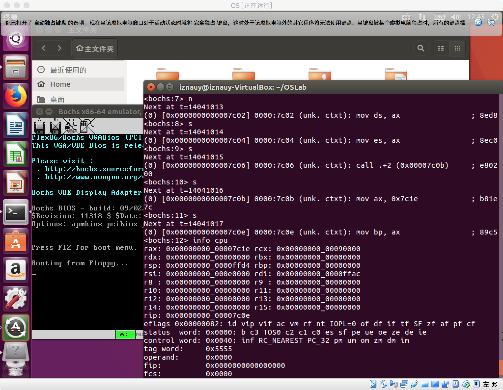
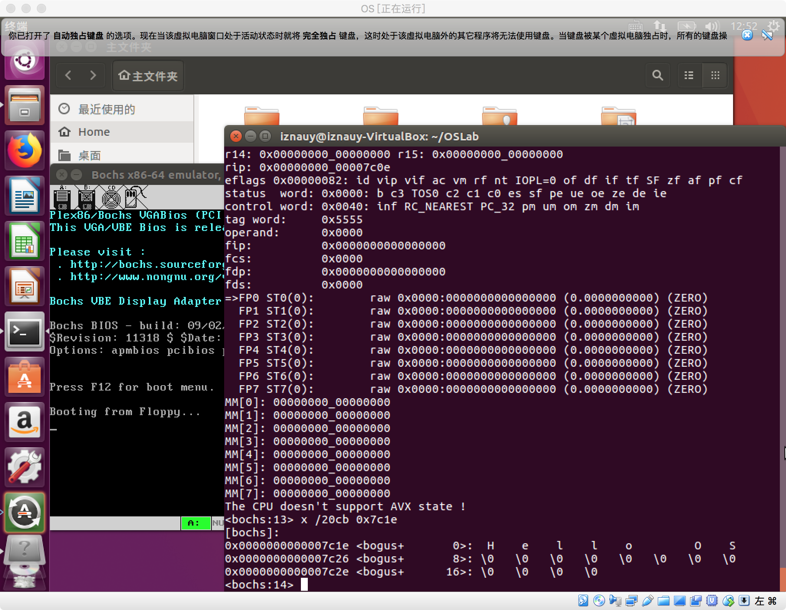
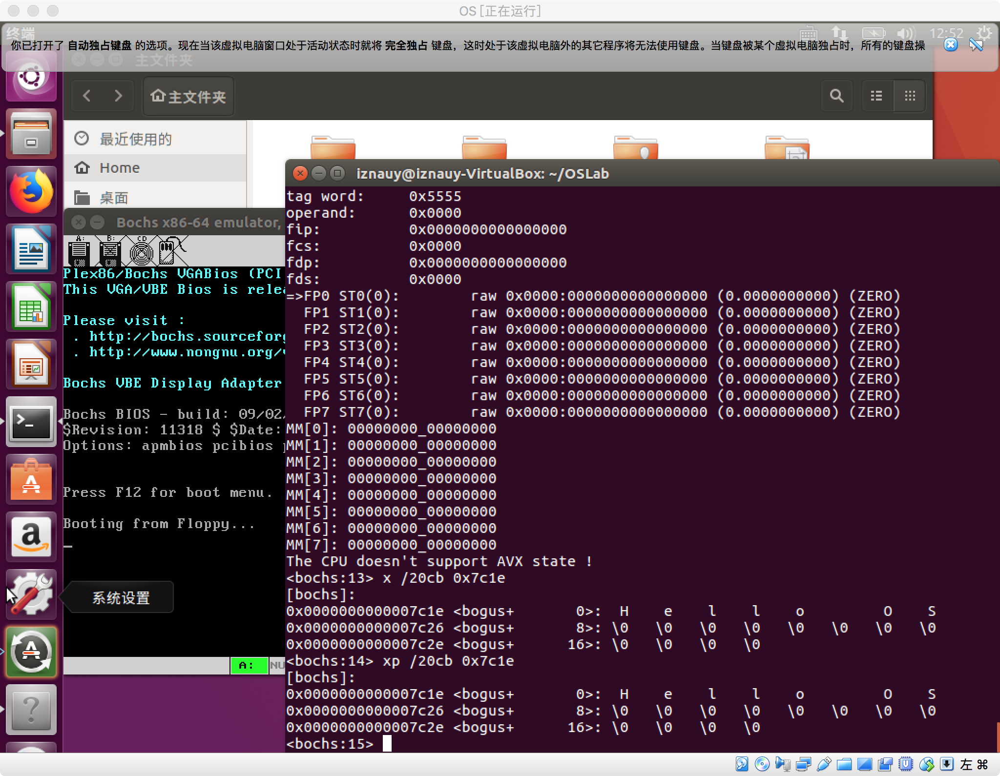

## 操作系统实验

```nasm
mov ax, BootMessage
mov bp, ax
```

- `ah`等于`13h`时，指令`int 10h`是一个串操作，表示写字符串，字符串的起始地址为`es:bp`；
- 由于这是引导扇区，因此在加载该引导扇区时候，`es`寄存器的基址为`0`；
- 由于刚开始的时候，有指令`org 0x7c00`，因此逻辑地址从`0x7c00`开始编址；
- `BootMessage`的逻辑地址被编址为`0x7c1e`；
- 所以，执行到该行时，`ax`中的值为`0x7c1e`，所以，`bp`中的地址也是`0x7c1e`；
- cpu使用相对寻址方式，也就是`es:bp`来查找字符串的地址，也就是`0 << 4 + 0x7c1e = 0x7c1e`；
- 这恰恰也是目标字符串在内存中的物理地址。

综上来说，就是在操作系统还没有运行起来之前，通过使用`org 0x7c00`，使得需要寻址时，逻辑地址和物理地址一致。

具体实验如下：

1. 查看`ax`寄存器



2. 查看线性地址



3. 查看物理地址


